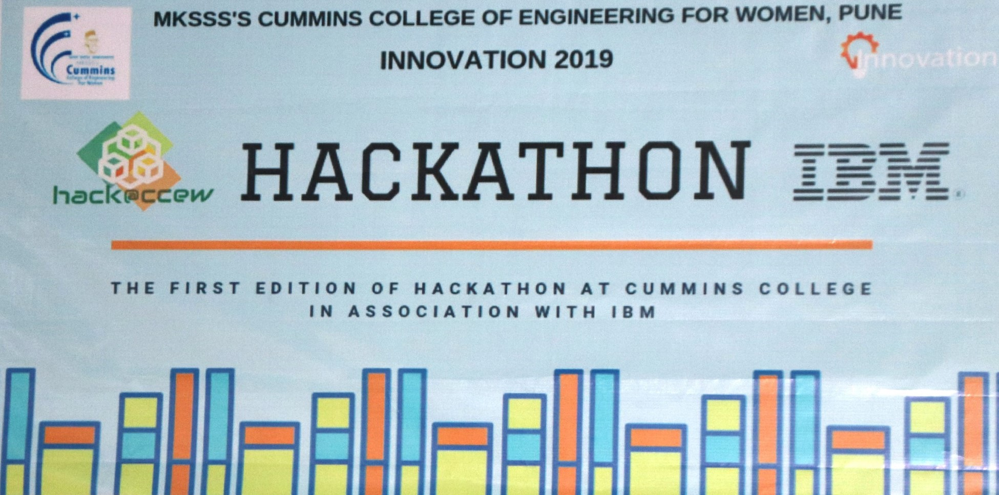
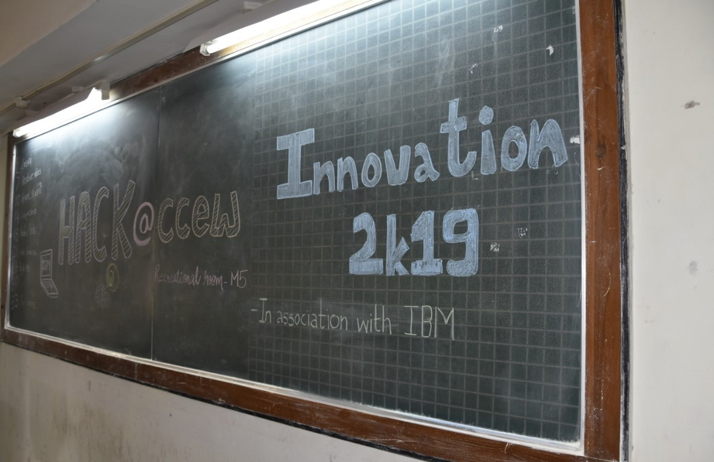
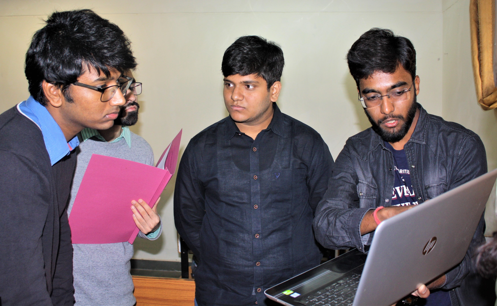

# Judge

I was invited to adjudicate the 'Hack@ccew,' an Artificial Intelligence Hackathon hosted by MKSS Cummins College of Engineering for Women, Pune, in collaboration with IBM.

Honored to share the stage with distinguished IBM employees and faculty members of Cummins College of Engineering.

As an evaluator, I was responsible for judging the student's solution according to the following criteria:

## Idea and Solution Approach

**Requirement Understanding**

- How well does one understand AI-driven chatbot in terms of requirements, stakeholders, capability, device compatibility, etc.?

- How well does one understand AI-driven Personal Assistant in terms of requirements, stakeholders, capability, device compatibility, etc.?

- How well does one understand AI minute changes in terms of requirements, stakeholders, capability, device compatibility, etc.?

- How well does one understand AI-driven Smart Identification in terms of requirements, stakeholders, capability, device compatibility, etc.?

**Requirement Feasibility**

- Understanding requirements in terms of features, components, innovation, user experience, etc.

**Requirement Feasibility**

- Due diligence to prioritize requirements to include Minimum Viable Products (MVP) without compromising on the most critical requirements.

## Application and USP

**Business Case**

- Useful business case?
- Socially relevant?
- Leads to improved efficiency?

**USPs**

- Creativity and Innovation.
- Uniqueness.

**User Experience**

- Information completeness, Easy Navigation, Guidance, Accessibility, Usability, Aesthetics, Engagement, Motivation, etc.

**Team Work**
 
- Equally distributed work.

**Time Management**

- Completion within the stipulated time.

## Limitation of the solution

**Limitations Aspects**
 
- Design limitation? How can you overcome it?
- Any platform limitations? Any other ways to overcome platform limitations (Any way to make the solution platform agnostic)

## Technology Stack

**Platform and Technology Selection**

- Single or compatible across all APIs (Watson, etc.)
- Simple design using the right technology?
- Modular design.

**Language**

- Natural language compatibility.
- Text to speech compatibility.

**Device Compatibility**

- Compatible with one device like a mobile phone or across a plethora of other devices like computers, smart speakers, wearable, or other IoT devices.

**Device Operability**

- Are tasks accomplished handsfree?

## Q/A

**Interaction with evaluators**

- Handling questions and queries.
- Completeness of response.
- Confidence.
- Knowledge.
- Research.

## Bonus Points

**Additional Points**
 
- Usage of IBM Technology.

 

