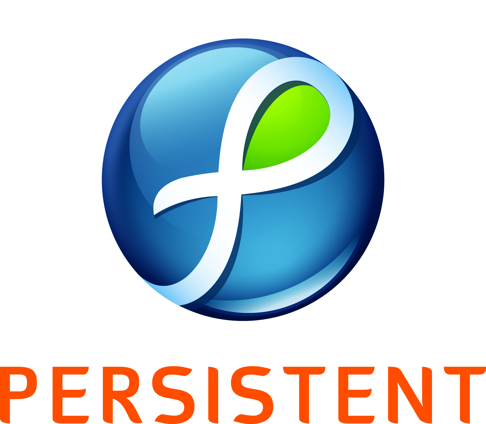

#### [ABOUT](./index.md) &ensp; [ACADEMICS](./academics.md) &ensp; [PROJECTS](./projects.md) &ensp; INTERNSHIPS &ensp; [RESEARCH](./research.md) &ensp;[CO-CURRICULAR](./extraCurricular.md) &ensp; [TUTORIALS](./tutorials.md) &ensp; [BLOG](./blogs.md)

------- 

# IBM

## Research Intern - (August 2018 - May 2019)

- Benchmarked the existing 3D machine learning techniques in use for object/scene regeneration and suggested the use of GANs as an alternative for Simultaneous Localization and Mapping.

# Tata Consultancy Sevices

## Systems Engineering Intern - (June 2018 - October 2018)

Project: Cloud Plus

- Prototyped a crude web-application for initiating video calls using AngularJS and WebRTC.

- Identified the key disadvantages of incumbent design, suggested the use of and set up the TURN server for initiating peer-to-peer communication when video call requests are blocked by firewalls. Tested the application on the thus setup TURN server.

- Programmed and maintained a script for encrypting the user credentials for initiating a secure connection.

- Designed an API that could consume the modules of video calling application along with existing services provided by TCS iON.

# Persistent Systems 

## Deep Learning Intern - ()

Project: Face Recognition, Emotion Analysis and Audio Annotation from videos

Developed an end-to-end workflow for a video search engine that analyses the video/live-stream to extract and store important features such as identity, emotion and objects in a frame. Processing this metadata to deliver search results based on user query.
